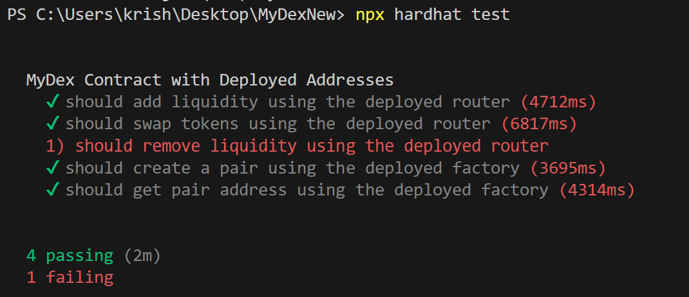

# DEx Platform

The MyDex.sol is the smart contract for the Decentralized Exchange(DEX). Users can `Add liquidity`, `Swap tokens` and `Remove liquidity` from the liquidity pool. The `MyDEx.sol` is implemented using the  UniswapV2 smart contract. The Contract is deployed on the `Polygon amoy` test network.

The `deployed Contract`  Address is : `0x7d8d2eA2ba6e3bdFC70C56890c1F470F8913e539`. Copy the Address and paste on the `amoy polygon scan` to see the transactions.

## SETUP

1. Clone the repository:

   ```bash
   git clone https://github.com/krishansinghal/MyDexNew
   ```

2. Navigate to the project directory:

   ```bash
   cd MyDEXNEW
   ```

3. Install the dependencies:

   ```bash
   npm install
   ```

4. Set up .env file:
   - Create a `.env` file in the root directory and add the following variables:

   ```bash
   POLYGON_AMOY_RPC_URL=https://rpc-amoy.polygon.technology/
   PRIVATE_KEY=your-private-key-here
   ```

6. Configure the `hardhat.config.js` file:
    -  if You want to deploy it on polygon testnet then use network as amoy, otherwise Select the network for your preference.

### Deployment

- The MyDex works on the `UniswapV2` smart contract. I have deployed the following for using it in the MyDex.sol:
    1) `UniswapV2Factory.sol` : Deployed on the Polygon Amoy testnet. The deployed contract address is : `0x85e527aFfCF6EF1538B0266F53e9b245a22De5E9`.
    
    2) `UniswapV2Router.sol` : Deployed on the Polygon Amoy testnet. The deployed contract address is : `0xc760322DEd5abbf9DA6367D7F257b15b5fFcd3fA`.

    3) `WETH9.sol` : Deployed on the Polygon Amoy testnet. The deployed contract address is : `0xc2684514Bd731A7044F62583bFaAFfC5510bfE50`.

-Two tokens are deployed on the Polygon Amoy testnet for the liquidity pool:

`TokenA`: Deployed on the Polygon Amoy testnet. The deployed Token address is : `0xaAc9F925547132A74ba74757E532A7DfffE54c65`.

`TokenB` : Deployed on the Polygon Amoy testnet. The deployed Token address is : `0x2E9B3083E142F90aedB50CF5cfC876d91Cc85D19`.

These Deployed contract's addresses are used at the time of deployment of MyDex.sol.

##### using RemixIDE

Open the `Contracts` folder in the remixIDE along with  `Uniswap deployed contract` folder(If you want to deploy your own uniswap contracts). 

###### Token Deployement

- Open the `TokenA.sol` file and compile it. Deploy the Selected file with the required Initial supply.
- Open the `TokenB.sol` file and compile it. Deploy the Selected file with the required Initial supply.

###### MyDEx Deployment

- Open the `MyDex.sol` file and compile it. At the time of deployment the following inputs will be required:
```bash
UniswapV2Factor_Address : 0x85e527aFfCF6EF1538B0266F53e9b245a22De5E9
UniswapV2Router_Address : 0xc760322DEd5abbf9DA6367D7F257b15b5fFcd3fA
TokenA : 0xaAc9F925547132A74ba74757E532A7DfffE54c65
TokenB : 0x2E9B3083E142F90aedB50CF5cfC876d91Cc85D19
```
`Note: Change the Addresses if you deployed your own require contracts`.

After the succesful deployment you will get the `Contract Address`.

- Copy the `Contract Address` and go to deployed Token contracts. Paste the contract address to the `Approve function` of deployed `tokenA`. Approve the require amount of tokens. 
- Repeat the same process for the `TokenB`.

After the succesful Approve, the MyDex is ready to perform the following Operations:

### Input Fields(parameters) in Functions:

Every function have some input fields(parameters) to perform the operations:

1) `Add Liquidity`: The add liquidity function require these parameters:

`amountADesired`: This is the amount you want to contribute for Token A in the liquidity pool.

`amountBDesired`: This is the amount you want to contribute for Token B in the liquidity pool.

`amountAMin`: The minimum amount of Token A that you’re willing to accept in the transaction. If the transaction would result in contributing less than this amount of Token A, the transaction will revert.

`amountBMin`: The minimum amount of Token B that you’re willing to accept in the transaction.
Similar to amountAMin, this prevents you from adding an undesirably small amount of Token B due to price fluctuations or slippage.

`to`: The address that will receive the liquidity pool (LP) tokens.

`deadline`: The Unix timestamp (in seconds) by which the transaction must be completed. If the transaction is not completed before this deadline, it will revert.

2) `Swap tokens`: The swap function require these parameters:

`amountIn`: The amount of the input token (the token you are swapping from) that you are sending to Uniswap for the swap.

`amountOutMin`: The minimum amount of the output token (the token you are swapping to) that you are willing to accept from the swap. If the actual amount of the output token (e.g., ETH) is less than this value, the transaction will revert. 

`calldata path`: The path of tokens to be swapped.For Example: `path=[TokenA_address, TokenB_address];`

`to`: This is the address where the swapped tokens will be sent after the swap. Typically, this is the user's wallet address.

`deadline`: The Unix timestamp by which the swap must be completed. If the swap is not completed before this timestamp, the transaction will revert.

3) `Remove Liquidity`:  The Remove liquidity function require these parameter.

`liquidity`: The amount of liquidity tokens to be removed from the pool.

`amountAMin`: The minimum amount of token A you are willing to receive when removing liquidity.

`amountBMin`: The minimum amount of token B you are willing to receive when removing liquidity.

`to`: The address that will receive the tokens after removing liquidity.

`deadline`: The Unix timestamp by which the removal of liquidity must be completed.


## Testing the Contract

- Open the cloned repository in the VScode.
- Go to the `test` folder and open `test.js` file.
- open the terminal and run the following commands:
`npx hardhat compile`
- after the succesful compile run the following command:
`npx hardhat test`

`test results`:
